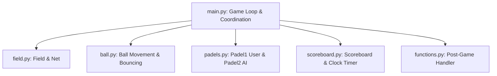

# Python Pong Game

A classic, retro-style arcade Pong game built entirely in **Python** using the standard `turtle` graphics library. The game features local player control, a patrolling AI opponent, real-time score tracking, a countdown timer, and an automated game-over screen determining the match result (Win/Loss/Draw).

---

## 🎮 How to Play

*   **Player 1 (Left Paddle):** Use the `W` key to move **Up** and the `S` key to move **Down**.
*   **Player 2 (Right Paddle / AI):** Autonomously patrols up and down to block your shots.
*   **Objective:** Score as many goals as possible before the match timer runs out!

---

## 🛠️ Technologies Used

The project is built lightweight, leveraging Python's standard libraries without requiring external third-party installations:

*   **Python 3**: The core programming language.
*   **Turtle Graphics (`turtle`)**: Used for rendering graphics, capturing keyboard inputs, handling simple movement physics, and drawing structural/text elements.
*   **Time Module (`time`)**: Used for managing the frame refresh rate (`time.sleep`) of the game loop.
*   **Random Module (`random`)**: Used to randomize the initial direction/angle of the ball after each point is scored.

---

## 🏗️ Architecture & Component Structure

The project is structured modularly, dividing the game entities, rendering, and logic into specific components.



### Component Details

| Component / File | Responsibility |
| :--- | :--- |
| **[main.py](file:///c:/Users/dell/Desktop/Pong%20Game/main.py)** | The central execution script. Initializes the screen environment, sets up key listeners, updates frames, manages collision checks, monitors scores/timers, and launches the post-game cleanups. |
| **[field.py](file:///c:/Users/dell/Desktop/Pong%20Game/field.py)** | Handles static graphics setup. Draws the dashed vertical line representing the midfield net divider. |
| **[ball.py](file:///c:/Users/dell/Desktop/Pong%20Game/ball.py)** | Manages the ball's coordinates. Handles continuous movement, resets to center on a point scored, and implements physics vectors for horizontal (`x_move`) and vertical (`y_move`) bounces. |
| **[padels.py](file:///c:/Users/dell/Desktop/Pong%20Game/padels.py)** | Contains paddle class definitions:<br>• `Padel1`: User-controlled paddle with screen boundaries.<br>• `Padel2`: AI-controlled paddle inheriting from `Padel1`, featuring a `patrol()` algorithm that automatically reverses directions at bounds. |
| **[scoreboard.py](file:///c:/Users/dell/Desktop/Pong%20Game/scoreboard.py)** | Contains two turtle-based counters:<br>• `Scoreboard`: Tracks individual player scores, redraws on screen, and renders the ending screen (Win/Loss/Draw).<br>• `Clock`: Keeps track of a real-time countdown timer. |
| **[functions.py](file:///c:/Users/dell/Desktop/Pong%20Game/functions.py)** | Housekeeper helper functions, such as `draw_post_game()` to hide paddles/ball, clear lines, and present the final results. |
| **[Break and Conquer.txt](file:///c:/Users/dell/Desktop/Pong%20Game/Break%20and%20Conquer.txt)** | Project plan mapping the game development phases (Setup, Controls, AI, Timers, Game Over). |

---

## ⚙️ How to Run

1. Make sure you have **Python 3** installed on your system.
2. Clone or navigate to the directory where the files are stored.
3. Open your terminal or command prompt and run:
   ```bash
   python main.py
   ```
